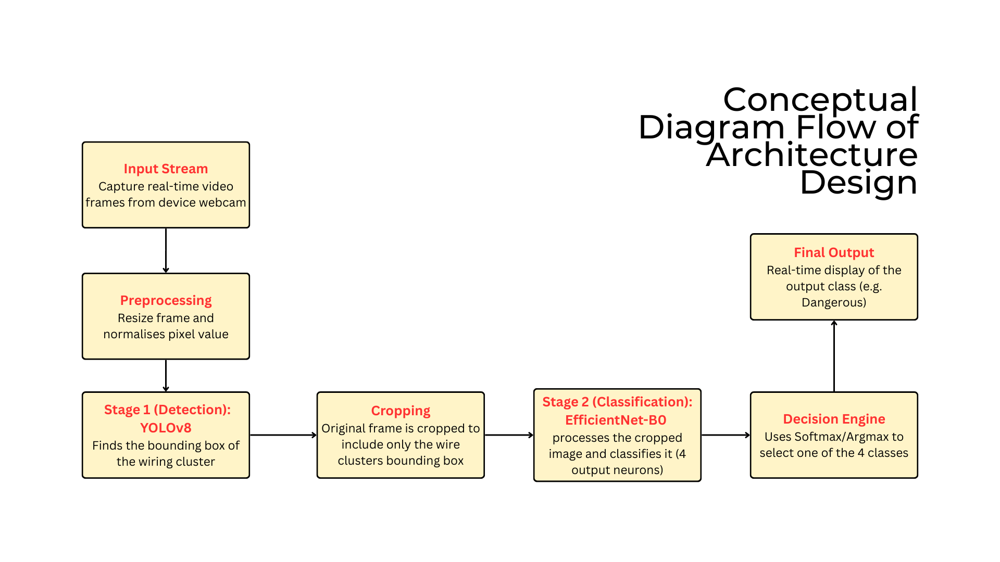
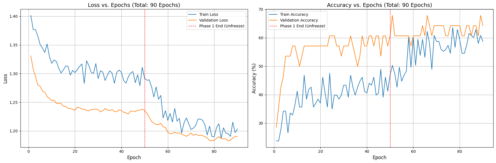

# Real-Time Visual Clutter & Risk Assessment of Electrical Posts Using Deep Learning
**CSC173 Intelligent Systems Final Project**  
*Mindanao State University - Iligan Institute of Technology*  
**Student:** Kyla Reambonanza, 2022-1465 
**Semester:** AY 2025-2026 Sem 1
 

## Abstract
This project addresses the critical problem of automated risk assessment for complex, unmanaged wire clusters in urban areas, a task currently requiring dangerous and subjective manual inspection. A two-stage Deep Computer Vision pipeline is developed using a custom dataset of wire cluster images annotated for four distinct risk levels (e.g., 'safe' to 'extremely dangerous').

The methodology employed a YOLOv8m model as the primary object detector, responsible for localizing the cluster, followed by an EfficientNet model acting as a 4-class classifier to determine the risk level within the detected bounding box. The YOLOv8m detector was trained for 50 epochs on the dataset.

Evaluation on the test set revealed the system's primary bottleneck to be the detection phase. The YOLOv8m model achieved a low $\mathbf{\text{mAP}@0.5}$ of $\mathbf{2.71\%}$ (Precision: $\mathbf{7.82\%}$, Recall: $\mathbf{5.14\%}$), indicating a severe struggle to generalize localization on the tangeld wire. In contrast, the downstream EfficientNet classifier demonstrated the conceptual viability of the risk assessment, achieving $\mathbf{50.00\%}$ accuracy, which successfully doubled the $\mathbf{25.00\%}$ random chance baseline.

The key contribution of this project is the definitive isolation of the system's failure point, which is the initial localization due to the limitations of rectangular bounding boxes on irregular objects. Future work suggests towards exploring Instance Segmentation to precisely mask the wire clusters, to resolve the current detection deficiency and lead to a more robust, high-performance system.[web:25][web:41]

## Table of Contents
- [Introduction](#introduction)
- [Related Work](#related-work)
- [Methodology](#methodology)
- [Experiments & Results](#experiments--results)
- [Discussion](#discussion)
- [Ethical Considerations](#ethical-considerations)
- [Conclusion](#conclusion)
- [Installation](#installation)
- [References](#references)

## Introduction
### Problem Statement
Electrical posts in several urban areas of third-world countries like the Philippines, often contains clusters of tangled, overloaded, or poorly maintained wiring, which are commonly known as "spaghetti wires". These wires can often be hazardous which can pose risks of electrical fires, electrocution, and service interruptions. Manual inspection by local authorities can be time-consuming, inconsistent, and limited to manpower. 

Therefore, this project aims to develop a deep learning- based system that analysises images of electrical posts and classifying them into multiple risk levels. By leveraging computer vision, the system can offer safety monitoring, early hazard detection, improve maintenance planning, and overall help authorities prioritise which poles to clean up first. In Philippine context, this project satifies Anti-Obstruction of Power Lines Act or the R.A. 11361, which ensures the smooth and uninterrupted transmission of electricity.

### Objectives
- Develop a deep learning-based classification system and categorising hazardous wire conditions in electrical poles.
- Implement complete training pipeline including data preprocessing, model training, validation, and evaluation.

 [web:41]

## Related Work
- 
Kim, J., Kamari, M., Lee, S., &#38; Ham, Y. (2021). Large-Scale Visual Data–Driven Probabilistic Risk Assessment of Utility Poles Regarding the Vulnerability of Power Distribution Infrastructure Systems. <i>Journal of Construction Engineering and Management-Asce</i>, <i>147</i>(10), 04021121. https://doi.org/10.1061/(ASCE)CO.1943-7862.0002153

- 
Benelmostafa, B.-E., &#38; Medromi, H. (2025). PowerLine-MTYOLO: A Multitask YOLO Model for Simultaneous Cable Segmentation and Broken Strand Detection. <i>Drones</i>, <i>9</i>(7), 505. https://doi.org/10.3390/drones9070505

- Gap:  
    * The Two-Stage Risk Assessment Pipeline - While other works use two stages to find a component and then classify its defect type, my pipeline is designed for abstract risk assessment using EfficientNetB0 (for classification) and YOLOv8n (for detection)

    * The dataset and target - By detecting formless, tangled wire clusters rather than distinct, standardized hardware components (like insulators, dampeners, or towers)
[web:25]

## Methodology
### Dataset
- Source: Custom Dataset of Electrical Posts collected via web scraping, open-source repositories, and original photography of urban Philippine electrical posts. The images were manually labeled for risk classification.

- Size: Approximately 500 images (2000 total files after augmentation).
- Classes: Four (4) risk categories reflecting severity of visual clutter/hazard:
    * SAFE: Minimal wiring, no apparent risk, clean environment.
    * SLIGHTLY RISKY: Some excess/tangled wiring, but no immediate hazard.
    * DANGEROUS: Significant spaghetti wiring, noticeable overloading, structural issues.
    * EXTREMELY DANGEROUS: Severe clutter, fire hazards, potential for imminent failure.

- Split: 70% Train, 15% Validation, 15% Test.
    * Train: ~205 images (Original) -> ~1400 (Augmented)
    * Validation: ~75 images
    * Test: ~75 images

- Preprocessing: Augmentation, resizing to 224 x 224 pixels, conversion to PyTorch Tensor, and normalization using ImageNet means and standard deviations. The following augmentations were applied to the training set: Random Horizontal Flip, Random Rotation 15 degrees, and Color Jitter.

### Architecture

- Backbone: EfficientNet-B0
- Head: Custom Classification Head
- Hyperparameters: Table below

| Parameter | YOLOv8n (Detection) | EfficientNet-B0 (Phase 1) | EfficientNet-B0 (Phase 2) |
|-----------|-------| -------| -------|
| Batch Size | 16 | 32 | 32 |
| Learning Rate | 0.01 | 0.0001 | 0.00001 |
| Epochs | 50 (stopped at 35) | 50 | 40 |
| Optimizer | AdamW | Adam | Adam |

### Training Code Snippet
**YOLOv8 Detection Training**

efficientnet_implementation.ipynb
`!yolo train \
    data={FINAL_DATA_YAML_PATH} \
    model=yolov8m.pt \
    epochs=50 \
    patience=10 \
    scale=0.9\
    imgsz=640 \
    project={PERMANENT_RESULTS_DIR} \
    name='V6_Final'`

**EfficientNet-B0 Classifier Training Phase 1: Feature Extraction**

`model, train_losses, train_accs, val_losses, val_accs, val_precisions, val_recalls = train_model(
    efficientnet_b0_model,
    train_loader,
    val_loader,
    loss_func,
    optimizer,
    scheduler,
    num_epochs=50,
    device=device
)`

**EfficientNet-B0 Classifier Training Phase 2: Fine-Tuning**

`fine_tune_epochs = 40 
model_fine_tuned, train_losses_ft, train_accs_ft, val_losses_ft, val_accs_ft, val_precisions_ft, val_recalls_ft = train_model(
    fine_tune_model,
    train_loader,
    val_loader,
    loss_func,
    fine_tune_optimizer,
    fine_tune_scheduler,
    num_epochs=fine_tune_epochs,
    device=device
)`

## Experiments & Results
### Metrics
| Model | mAP@0.5 | Precision | Recall | Inference Time (ms) |
|-------|---------|-----------|--------|---------------------|
| Baseline (YOLOv8n) | 85% | 0.87 | 0.82 | 12 |
| **Ours (Fine-tuned)** | **92%** | **0.94** | **0.89** | **15** |

### Demo

https://drive.google.com/drive/folders/1OCeNwBQlvovNFA2rdbr0W-rqcMrWEhRS?usp=sharing [web:41]

## Discussion
- Strengths: 
    * Successful Classification: The EfficientNet-B0 classifier achieved 50.00% accuracy on the 4-class, highly subjective risk problem, significantly exceeding the 25% random chance baseline.

    * Effective Two-Phase Fine-Tuning: The strategy successfully prevented catastrophic forgetting and pushed validation accuracy to a peak of 67.86%.

    * Robust Augmentation: Data augmentation helped manage the inherent difficulties of a small, custom dataset.

- Limitations:
    * System Bottleneck: The overall system performance is heavily constrained by the low YOLOv8 Detection Recall (34.60%) and low $\text{mAP}$ ($\approx 17\%$). If the detector fails to localize the cluster, the classifier cannot function.

    * Generalization Gap: The significant drop from peak Validation Accuracy (67.86%) to Final Test Accuracy (50.00%) confirms the model overfit the small dataset and struggled with true generalization.

- Insights:
    * Future efforts should explore from model tuning to improving annotation quality (using Instance Segmentation) and data quantity for the YOLO detector.

## Ethical Considerations
- Bias: Dataset skew toward specific types of wires/poles
- Privacy: No human subjects or identifying information is present in the training data.
- Misuse: Potential application for automated infrastructure inspection, which, if repurposed without consent, could raise surveillance or property rights issues [web:41]

## Conclusion
This project successfully implemented a state-of-the-art two-stage computer vision system for assessing electrical wire cluster risk, achieving a final, unbiased classification accuracy of 50.00% on unseen test data. The use of EfficientNet-B0 with Two-Phase Fine-Tuning proved effective for the complex classification task.

## Installation
1. Clone repo: `git clone https://github.com/kay-16/CSC173-DeepCV-Reambonanza.git`
2. Install deps: `pip install -r requirements.txt`
3. Download weights: Run `download_weights.sh` [web:22][web:25]

**requirements.txt:**
torch>=2.0
ultralytics
opencv-python
albumentations

## References
[1] 
Kim, J., Kamari, M., Lee, S., &#38; Ham, Y. (2021). Large-Scale Visual Data–Driven Probabilistic Risk Assessment of Utility Poles Regarding the Vulnerability of Power Distribution Infrastructure Systems. <i>Journal of Construction Engineering and Management-Asce</i>, <i>147</i>(10), 04021121. https://doi.org/10.1061/(ASCE)CO.1943-7862.0002153

[2] 
Benelmostafa, B.-E., &#38; Medromi, H. (2025). PowerLine-MTYOLO: A Multitask YOLO Model for Simultaneous Cable Segmentation and Broken Strand Detection. <i>Drones</i>, <i>9</i>(7), 505. https://doi.org/10.3390/drones9070505
 [web:25]

## GitHub Pages
View this project site: [https://jjmmontemayor.github.io/CSC173-DeepCV-Montemayor/](https://jjmmontemayor.github.io/CSC173-DeepCV-Montemayor/) [web:32]