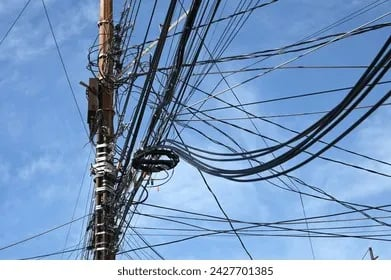

# CSC173 Deep Computer Vision Project Progress Report
**Student:** Kyla Reambonanza, 2022-1465  
**Date:** December 16, 2025  
**Repository:** https://github.com/kay-16/CSC173-DeepCV-Reambonanza.git

## 📊 Current Status
| Milestone | Status | Notes |
|-----------|--------|-------|
| Dataset Preparation | ✅ In Progress | [X] images downloaded/preprocessed |
| Initial Training | ⏳ Pending | [X] epochs completed |
| Baseline Evaluation | ⏳ Pending | Training ongoing |
| Model Fine-tuning | ⏳ Not Started | Planned for tomorrow |

## 1. Dataset Progress
- **Total images:** [e.g., 4,200]
- **Train/Val/Test split:** [e.g., 70%/15%/15% or 2,940/630/630]
- **Classes implemented:** 
* 4 classes and labels:
    * Safe = 0–25% clutter
    * Slightly risky = 26–50%
    * Dangerous = 51–75%
    * Extremely dangerous = 76–100%
    
- **Preprocessing applied:** Resize(640), normalization, augmentation (flip, rotate, brightness)

**Sample data preview:**

(dataset/train/extremely_dangerous/image_1.jpeg)
(dataset/train/safe/image_1.jpeg)
(dataset/train/slightly_risky/image_1.jpeg)

## 2. Training Progress

**Training Curves (so far)**

**Current Metrics:**
| Metric | Train | Val |
|--------|-------|-----|
| Loss | [0.45] | [0.62] |
| mAP@0.5 | [78%] | [72%] |
| Precision | [0.81] | [0.75] |
| Recall | [0.73] | [0.68] |

## 3. Challenges Encountered & Solutions
| Issue | Status | Resolution |
|-------|--------|------------|
| CUDA out of memory | ✅ Fixed | Reduced batch_size from 32→16 |
| Class imbalance | ⏳ Ongoing | Added class weights to loss function |
| Slow validation | ⏳ Planned | Implement early stopping |

## 4. Next Steps (Before Final Submission)
- [ ] Complete training (50 more epochs)
- [ ] Hyperparameter tuning (learning rate, augmentations)
- [ ] Baseline comparison (vs. original pre-trained model)
- [ ] Record 5-min demo video
- [ ] Write complete README.md with results